# DSPLab

This repository contains code for digital signal processing (DSP) lab experiments. It is designed to generate and visualize basic discrete-time signals commonly used in DSP. Currently, the repository includes **Experiment 1: Basic Signals**, with each signal implemented in a separate Python script under the `experiment1/` directory. Each script generates one signal and plots its waveform.

## 🔧 Setup and Installation

To run the experiments, you need Python 3 with NumPy and Matplotlib. Follow these steps:

1. **Clone the repository**:
   ```bash
   git clone https://github.com/sreeramathrij/DSPLab.git
   cd DSPLab
   ```

2. **Create a virtual environment** (optional but recommended):
   ```bash
   python -m venv venv
   ```

3. **Activate the virtual environment**:
   - On Linux/macOS:
     ```bash
     source venv/bin/activate
     ```
   - On Windows:
     ```bash
     venv\Scripts\activate
     ```

4. **Install required packages**:
   ```bash
   pip install numpy matplotlib
   ```

5. **Run the experiment scripts**:
   ```bash
   python experiment1/sine.py
   ```

# Experiment 1: Elementary Signals

## AIM:
To plot sine, cosine, ramp, exponential, impulse, rectangular, bipolar pulse and triangular signals in continuous and discrete forms.

| File            | Description                        |
|-----------------|------------------------------------|
| `sine.py`       | Generates a sine wave              |
| `cosine.py`     | Generates a cosine wave            |
| `triangular.py` | Generates a triangular waveform    |
| `rectangular.py`| Generates a rectangular pulse      |
| `bipolar.py`    | Generates a bipolar waveform       |
| `impulse.py`    | Generates a unit impulse           |
| `ramp.py`       | Generates a ramp function          |
| `exponential.py`| Generates an exponential signal    |

## 📐 Signal Equations
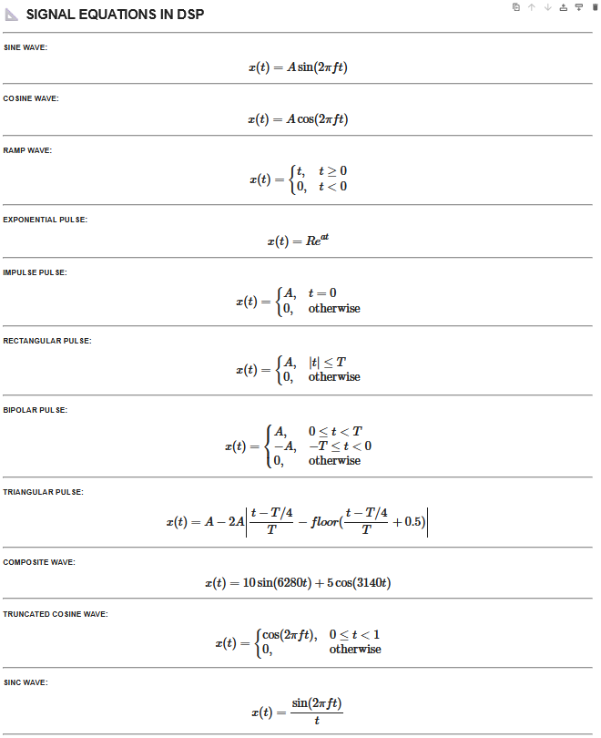

## 📷 Example Outputs

Each script generates and plots a waveform. Add the output images in the respective directory and name them as follows:
### SINE
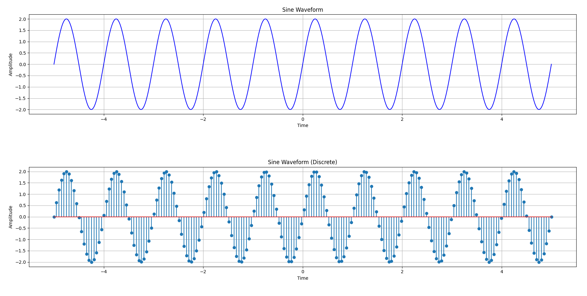

---

### COSINE
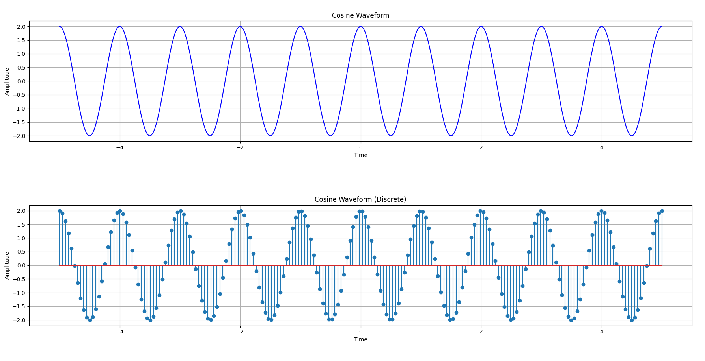

---

### EXPONENTIAL
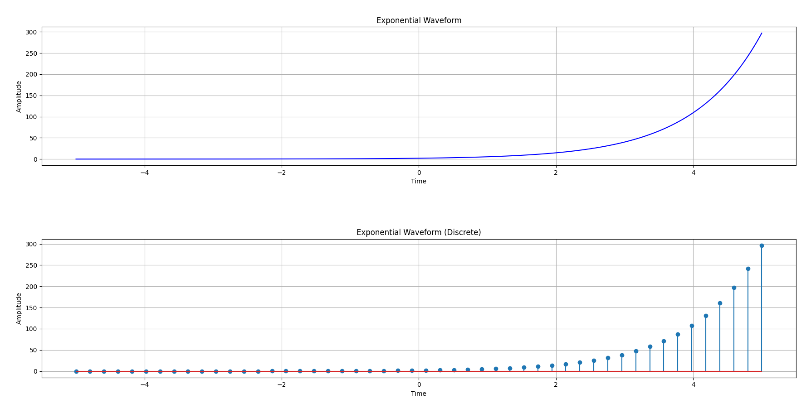

---

### RAMP
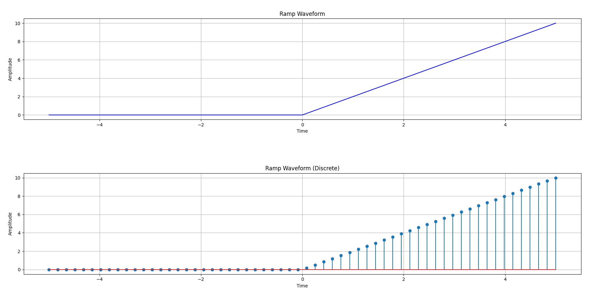

---

### RECTANGULAR
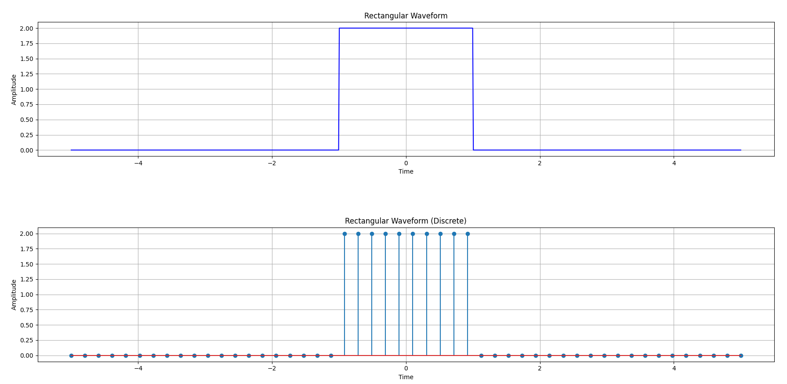

---

### IMPULSE
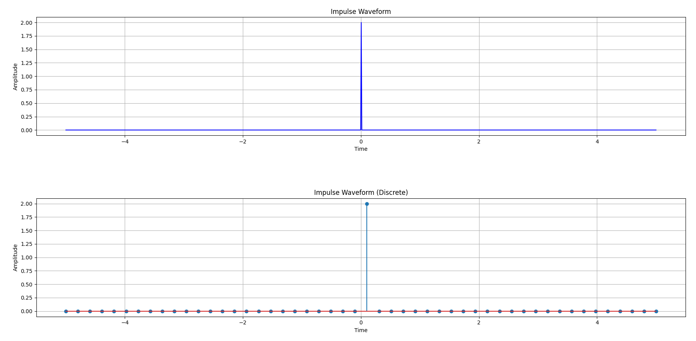

---

### BIPOLAR
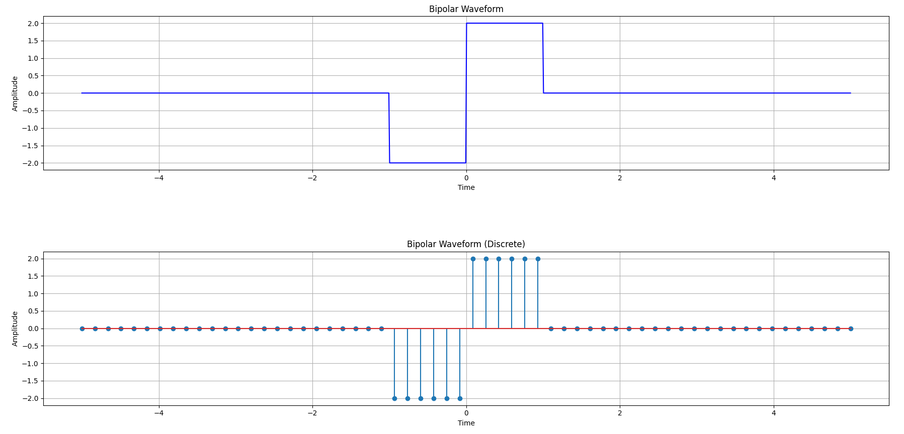

---

### TRIANGULAR
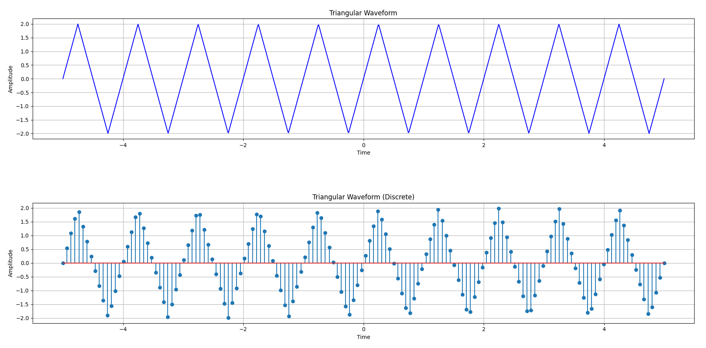

---

### COMPOSITE
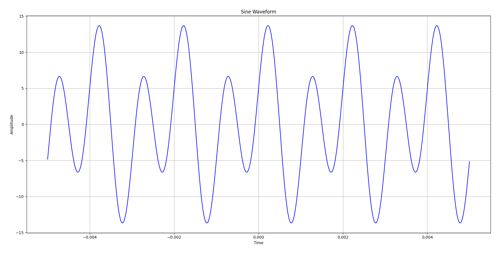

---

### TRUNCATED
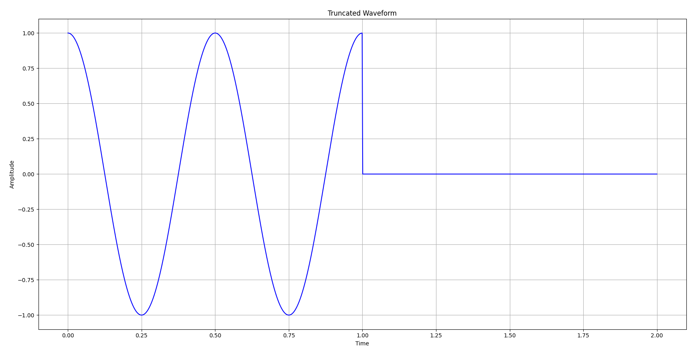

---

### SINC
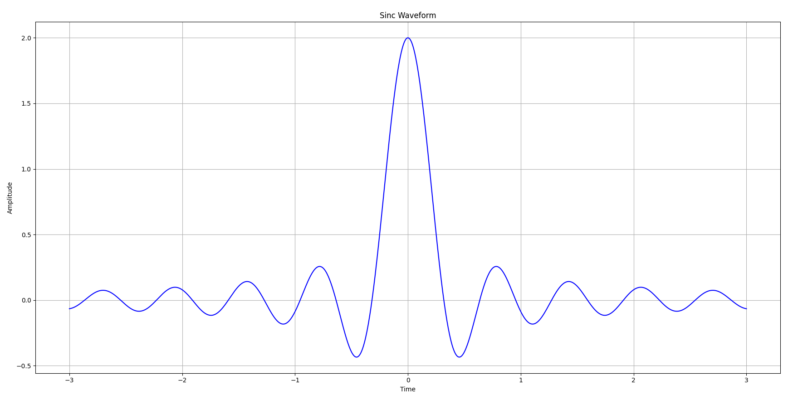

---
## 👤 Author

Developed by [sreeramathrij](https://github.com/sreeramathrij)
